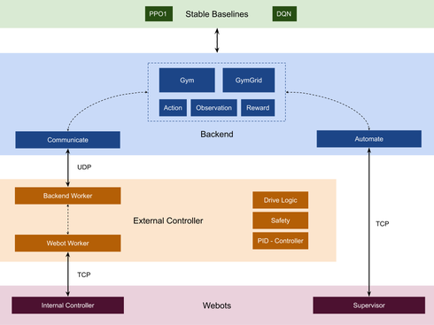
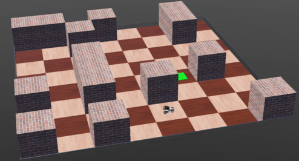

# Safe Reinforcement Learning 1
Mats Kipper | Jonas Dommes | Shanshan Yin | Fabian Peddinghaus | Rui Li | Wladimir Assmann | Per Joachims

## Project overview
In this project we tackled the autonomous driving of a robot to a predetermined goal in the open-source robot simulation software [Webots](https://www.cyberbotics.com/). Our software tries to mimic realistic training by sending data via UDP/TCP between all components.

### Goals
At the start of the project, our goal was to create a robot in Webots that learns to reach a target in an unknown environment. Furthermore, it was supposed to avoid crashes, even while training. We set the goal to simulate sensor noise and incorporate solutions to handle communication failure.

However, the complexity of reinforcement learning in a continuous world requires time consuming experiments. Therefore, we decided to create an environment where we can dynamically change parameters, both relating to the overall world and the way the agent interacts with the robot. Additionally, we enabled the robot to make grid moves in a checkerboard-like world.

### Requirements
In this project we were required to have separate entities for the Webots and external controller, both supposed to be written in C/C++. Furthermore, the backend, written in Python, was supposed to be the third independent part. The communication between all components ought to happen using a network interface. Using this, the robot had to be able to reach a relatively small GPS target in a world filled with obstacles, while driving *safely*. Safe in this context is meant to not crash into obstacles.

### Approach
In this project we focused on building an infrastructure to use existing and well-documented reinforcement learning algorithms to train and apply to Webots. Our approach was to simultaneously work on Webots/controller and backend. Our project can roughly be separated into three phases:
1. Set up the communication from internal controller through external controller to backend. Build a *FakeGym* to generate learnings about both the process of creating a custom gym and reinforcement learning basics.
2. Create an automation protocol to initialize randomized worlds and autonomously run the training. Improve the performance of the agent in the *FakeGym*.
3. Create a grid-based Webots world to reduce the complexity for the agent and allow for transferable learnings made in the *FakeGym*. Conduct experiments in the continuous gym. Implement safety logic in the external controller.

## System architecture
To simulate the realistic behavior of a robot performing actions, we split our software into a controller - internal and external - and backend part. The external controller communicates with the backend and sends commands to the internal controller, which merely executes them. In a real world design, both would run on the robot's hardware. The backend, running on an external server, is responsible for evaluating sensor data and generating actions. To simplify the learning process we build a wrapper around our whole architecture to create a custom extension of OpenAI gym. This *WbtGym* can be used with any algorithm from [stable baselines](https://stable-baselines.readthedocs.io/).

### Software design
To showcase our *communication*, we will now examine how an action is generated and executed: The robot is randomly placed in a world and observes its environment using sensors. This sensor data is forwarded to the external controller via TCP/IP. The external controller formats and augments the data. It then sends the data via UDP/IP to the backend. In the backend the reinforcement learning agent calculates a corresponding action in order to maximize a reward function. This action is sent to the external controller, who in turn interprets and forwards the action to the robot. The internal controller performs the action by setting the robot's motor speed and steering angle. This process is done iteratively until the robot reaches its goal or the run is stopped.

Specifically, we have three patterns of communication between backend and external controller:
* Send an action *or* ask for new data
* Send an action *and* ask for new data after some number of Webots time steps
* Perform a grid move and get new data once this move is fully executed by the *drive logic*

An action is a tuple (direction, speed), consisting of two floats in [-1, 1]. The external controller interprets the direction value as *steering* or *heading*. The former directly sets the steering angle of the robot, the latter defines a cardinal direction in which the robot should move. In the *heading* mode the external controller then sets the steering angle accordingly. The different modes can be tested by executing our scripts and using the arrow keys on a keyboard. Further, we can specify *absolute* or *relative* actions, where *absolute* means just forwarding the action while *relative* leads to a change of the last action by a set amount.

To train a reinforcement learning agent, we need a substantial amount of training runs. Even in our - quite simple - *FakeGym* the robot requires about 500 to 1,000 different environments to learn. To generate random worlds, we created an *automation* protocol between the backend and the internal controller. Using this we can start all components and create a random world in Webots with a set amount of obstacles and and a specific size. More importantly, we can end a training run and reset the world when we need to. This way our *WbtGym* resembles the OpenAI gym.

### Robot design
Our aim was for the robot to behave similar to a self-driving car. Therefore, we build it with a drive axle and a steering axle. This way the robot does not need to stop to turn which leads to smooth driving. While this made solving the grid-based environment more difficult, we did not want to change our initial design. Instead, we implemented a *drive logic* that made the robot drive from tile to tile.

To observe the environment, the robot uses the following sensors:
* A lidar sensor on top, similar to those used for autonomous cars, to detect obstacles in all directions.
* A compass to identify the direction the robot is pointing at.
* A GPS module to determine the robots current position and speed.
* A sensor to monitor the current position of the steering axle.
In the following picture only the lidar sensor on top is visible.

### Environment design
Our worlds are randomly generated based on a grid system. The robot and the target are both placed in the middle of a tile. Obstacles are exclusively boxes. This allows us to use the same worlds for our grid-based and continuous approaches. It also assures that there is enough space between to obstacles for the robot to move through. This constitutes a simplification that was necessary in order to use transfer learning from the *FakeGym* and therefore speed up the training process substantially.

Using the same environment for learning leads to the robot to merely memorize its surrounding and a path to the goal, instead of generalizing. Therefore, the backend can randomly reset the environment with the same world size and number of obstacles, but placed differently. Generalizing is important, as it allows the robot to be able to solve unknown environments as well.

### Algorithms
As described in our software design, we build a custom environment following the interface of the OpenAI gym. The required functionality (see also: [stable-baselines custom environments](https://stable-baselines.readthedocs.io/en/master/guide/custom_env.html)) for custom environments consists of:
* *action_space* defines the possible actions for the robot, e.g. discrete or continuous actions. This is set in our *action_class*. We provide both options and the possibility to use a custom *action_class*.
* *observation_space* defines the size of the observation. Can be customized as well.
* *step(action)* applies the action from the reinforcement learning agent to the environment. This is handled by mapping the action with the action_class and sending it via the external controller to Webots.
* *reset()* is used to randomly create new worlds where the robot can train in after the current run has ended.
* *render()* normally renders the environment. This is not needed here.
* *close()* terminates the environment.

Further, we included the option to use a custom reward function with the *evaluate_class* as parameter for the *WbtGym*.

Our *WbtGym* can be used with any algorithm from [stable-baselines](https://stable-baselines.readthedocs.io/). After numerous experiments in our *FakeGym* - an extension of the OpenAI gym - we decided to use the *PPO1* algorithm for training.

## Summary
In our project we have **achieved** the following goals:
* Setup the Webots world and the communication from internal controller to external controller to backend.
* Incorporate a safety layer to fulfill the requirement of **safe** reinforcement learning where the robot does not crash, even while training.
* Build a wrapper around Webots with the interface of the OpenAI gym, enabling us to train any algorithm from stable baselines.
* Build a *FakeGym* to generate learnings, train models and apply transfer learning.
* Apply a PPO1 trained on the *Fakegym* on our *WbtGymGrid*.
* Automatically train in our *WbtGym*.

Prior to this project, none of us had experience with reinforcement learning projects. Therefore, we might have started a bit too optimistic and sadly were not able to achieve the following goals:
* Successfully train a PPO1 in a continuous randomized world. Compared to grid based worlds, training in continuous environments takes a substantially larger amount of time and requires good hardware. For example, testing a small tweak in the reward function can take more than a night to evaluate. We are convinced that with more time and experiments, this problem is solvable with the infrastructure we build.
* The subsequent and optional goals, such as incorporating sensor noise to make the communication even more realistic or adding a second robot, were also not attained, as they would have complicated the continuous training process even more.

### Lessons learned
As none of us had prior knowledge in the area of reinforcement learning, we decided to use an agile approach to this project. This allowed us to flexibly direct our work to the currently most important aspects of our project. Further, this summer only virtual teamwork was possible due to COVID-19. This was especially challenging and created some organizational overhead. We experienced that weekly meetings with stand-ups as well as sprints with a length of about three weeks were optimal to balance teamwork, flexibility and long-term progress. Further, we learned a great deal about reinforcement learning projects and their computational requirements.

For this project, we used the version control software Git in conjunction with GitHub. For some of us, this was the first larger project, meaning more than three team members, and we were able expand our knowledge about Git and GitHub, especially regarding branching and GitHub actions. This is an essential skill for our future work environments.

### Future work
If we were to continue this project, we would further try to solve the problem of reaching the target in a continuous world with continuous actions and observations. Further, it would be challenging and interesting to increase the complexity of the world even further and come closer to modeling realistic self-driving cars.
